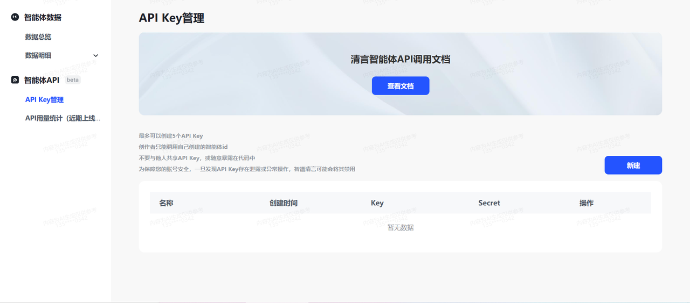
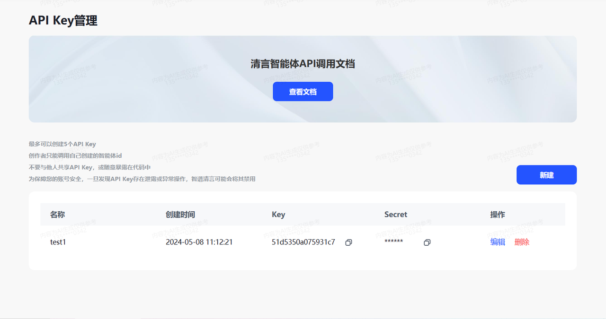

# Zhipu-Qingyan-Agent-cookbook

<h1>
  
  Zhipu-Qingyan-Agent-cookbook
</h1>

目前是第（1）版

在今天，智谱AI终于开放了智谱清言智能体api调用的功能，这个功能的公开，代表着智谱清言生态的进一步扩大。智能体的应用不再限于网页和手机app应用中，而真正进入了开发者的群体中！通过对智能体api的调用，及开发者社区的强大的创造能力，对智谱清言生态益处可谓是更上一层楼！

接下来，我将逐一实践智谱清言智能体api调用的功能，然后使用我目前正在开发的项目，与智谱清言智能体api调用相结合。让我们看看会有什么奇妙的化学反应发生！😜

但请注意，当前智谱清言智能体仅支持通过API方式调用创作者自己创建的智能体。

## 智谱清言智能体api调用鉴权

### 获取access_token

与ChatGLM的api调用有一定的相似之处，首先，在鉴权之前，我们先需要获取Access Token。

第一步，打开https://chatglm.cn/developersPanel/apiSet，找到智能体API管理界面。

界面如下：

然后点击新建，再输入名称。

最后新建的结果如下图：

根据使用文档的定义，编写的脚本如下：

